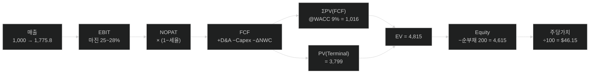

# DCF 밸류에이션 — DEMO Corp

> 📄 **Excel/Office 산출물 대체용** — 마크다운+mermaid 시각화 (파이썬 의존성 없음).
> 입력: [`scenarios/dcf.md`](../scenarios/dcf.md) · 스킬: [`demo-visualizer`](../../.claude/skills/demo-visualizer/SKILL.md)
> 원래 Model Builder 에이전트는 live-formula 엑셀 워크북을 만든다. 이 리포트는 같은 계산을 의존성 없이 보여준다.

## 가정 (입력)

매출(FY0) 1,000 · 주식 100M · 순부채 200 · 현재가 $50 · 세율 25% · **WACC 9.0%** · **terminal growth 3.0%** (단위 $M)

## 계산 체인

## 연도별 추정

| 항목 | FY1 | FY2 | FY3 | FY4 | FY5 |
|---|---:|---:|---:|---:|---:|
| 매출 | 1,160.0 | 1,322.4 | 1,481.1 | 1,629.2 | 1,775.8 |
| EBIT | 290.0 | 343.8 | 399.9 | 456.2 | 497.2 |
| FCF | 189.9 | 228.4 | 269.2 | 311.0 | 340.5 |
| PV(FCF) | 174.2 | 192.2 | 207.9 | 220.3 | 221.3 |

ΣPV(FCF) = **1,016.0** · Terminal value 5,845.3 → PV(TV) = **3,799.0** · **EV = 4,815.0** · Equity = 4,615.0

## 결론

| | 값 |
|---|---|
| **주당 내재가치** | **$46.15** |
| 현재 주가 | $50.00 |
| 상승여력 | **−7.7%** (고평가) |

## 민감도 — 주당가치 ($)

| WACC \ g | 2.5% | 3.0% | 3.5% |
|---|---:|---:|---:|
| **8.5%** | 46.99 | 50.71 | 55.18 |
| **9.0%** | 43.06 | **46.15** | 49.81 |
| **9.5%** | 39.69 | 42.29 | 45.33 |

검증: terminal growth(3%) < WACC(9%) ✓ — 수학적으로 유효.

> ⚠️ **투자 권유 아님.** 초안 산출물이며, 가정·결과는 자격 있는 전문가의 검토 대상이다.
