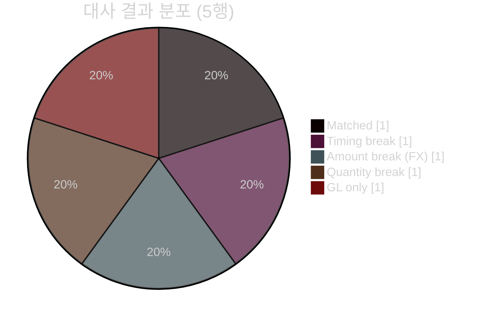

# GL ↔ 보조원장 대사 결과 — 2026-05-05 (주식)

> 📄 **Excel/Office 산출물 대체용** — 마크다운+mermaid 시각화 (파이썬 의존성 없음).
> 입력: [`scenarios/gl-recon.md`](../scenarios/gl-recon.md) · 스킬: [`demo-visualizer`](../demo-visualizer/SKILL.md)
> 원래 GL Reconciler 에이전트는 break-report 엑셀을 만든다. 이 리포트는 같은 결과를 의존성 없이 보여준다.

## 대사 파이프라인

## 요약

5행 비교 · **Matched 1 · Breaks 4** · 매칭률 20%

## Break 상세 (|Δbase| 내림차순)

| security_id | 버킷 | 추정 원인 | GL base | Sub base | \|Δbase\| | 비고 |
|---|---|---|---:|---:|---:|---|
| JKL012 | GL only | Duplicate/missing | 9,000 | — | 9,000 | GL에만 있고 보조원장에 없음 |
| MNO345 | Quantity break | Data quality | 20,000 | 21,250 | 1,250 | 수량 800 vs 850 |
| DEF456 | Amount break | **FX** | 43,600 | 43,200 | 400 | local 일치, base 불일치 (fx 1.09 vs 1.08) |
| ABC123 | Timing break | Timing | 50,000 | 50,000 | 0 | posting 5/7 vs 5/5, 금액 일치 |

(GHI789 = Matched)

> ⚠️ **기표는 사람 승인 (No ledger posting).** 이 리포트는 사인오프용 초안이며, 원장 조정은 사람(컨트롤러)이 승인한다.
