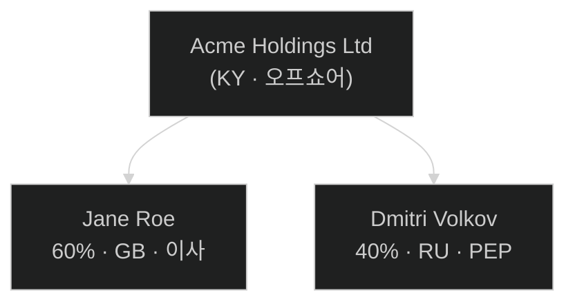
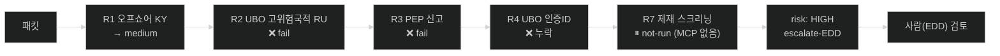

# KYC 스크리닝 결과 — PKT-DEMO-001 (Acme Holdings Ltd)

> 📄 **Excel/Office 산출물 대체용** — 마크다운+mermaid 시각화 (파이썬 의존성 없음).
> 입력: [`scenarios/kyc.md`](../scenarios/kyc.md) · 스킬: [`demo-visualizer`](../demo-visualizer/SKILL.md)
> 원래 KYC Screener 에이전트는 에스컬레이션 엑셀을 만든다. 이 리포트는 같은 판정을 의존성 없이 보여준다.

## 신청자

| 항목 | 값 |
|---|---|
| 법인 | Acme Holdings Ltd |
| 유형 / 관할 | entity / Cayman Islands (KY) |
| 리스크 등급 | **HIGH** |
| 디스포지션 | **escalate-EDD** |

## 지분 구조

## 룰 판정 흐름

## 룰 결과

| rule_id | outcome | 근거 |
|---|---|---|
| R1 | fail | 관할 KY (오프쇼어 리스트) |
| R2 | **fail** | UBO Dmitri Volkov 국적 RU (고위험) |
| R3 | **fail** | PEP 신고 (Dmitri Volkov) |
| R4 | fail | UBO 인증 신분증 누락 |
| R5 | pass | 주소증빙 2026-05-10 (≤3개월) |
| R6 | pass | 자금출처 ref SOF-LON-2023-0830 |
| R7 | n/a | 스크리닝 MCP 없음 — **clear 전 반드시 실행** |

**누락 서류**: UBO별 인증 신분증
**에스컬레이션 사유**: R2(고위험 관할 RU), R3(PEP 신고)

> ⚠️ **스킬은 승인하지 않는다.** 점수·라우팅만 하고, 최종 판단은 사람(EDD 심사자)이 한다.
