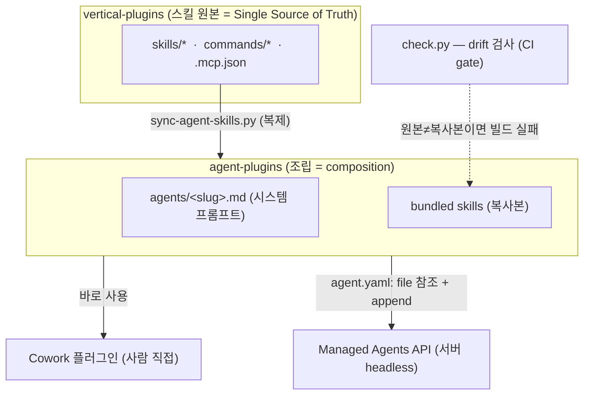
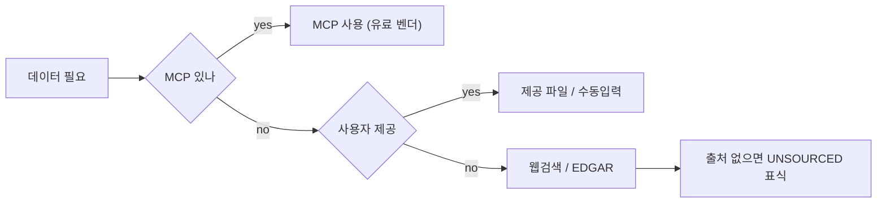
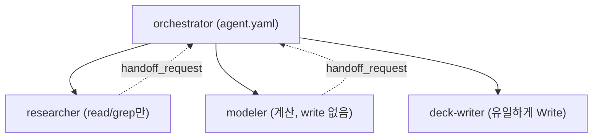
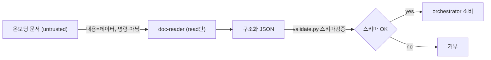
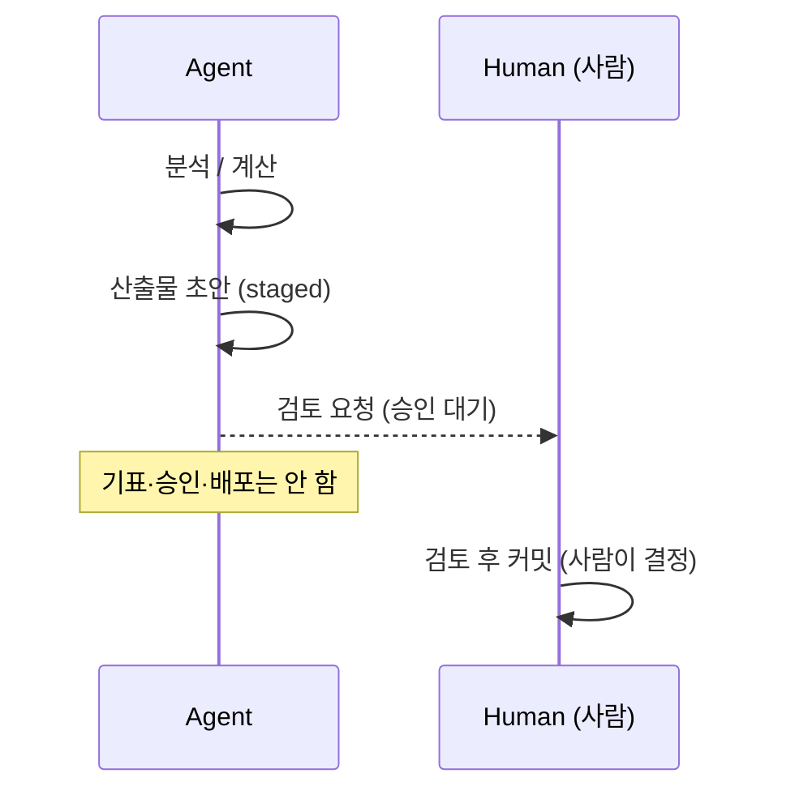

# 01. 스터디 발표용 — 설계 패턴으로 읽는 financial-services

> 대상: **백엔드(스프링) 개발자**. 각도: "AI 에이전트 레포지만, 사실은 **아키텍처 패턴 교본**."
> 금융 도메인은 배경. 각 패턴을 **스프링 이디엄 + SOLID/KISS/DRY**에 매핑한다.
> 데모 실행은 [`demo/`](../demo/), 난이도/검증은 [02-demo-test](02-demo-test.md), 도메인 상세는 [03-overview](03-overview.md).

## 0. 한 줄 훅

> "이 레포는 마크다운/JSON 파일 더미다. 빌드도 없다. 그런데 그 안에 **SSoT·헥사고날·DI·오케스트레이터-워커·최소권한·신뢰경계·승인게이트**가 다 들어있다. 우리가 매일 쓰는 패턴이 AI 에이전트에도 똑같이 적용된 사례."

## 1. 전체 구조 (한눈에)

## 2. 설계 패턴 7개 (레포 → 패턴 → 스프링 → 원칙)

| # | 레포의 것 | 패턴 | 스프링 개발자 비유 | 원칙 |
|---|---|---|---|---|
| 1 | 스킬 원본은 vertical에만, 에이전트엔 복제 + `check.py` drift 검사 | SSoT / 코드젠·벤더링 | 공유 모듈(BOM) 한 곳, 복붙 금지 + CI 검증 | **DRY** |
| 2 | 같은 프롬프트+스킬 → Cowork / Managed API 두 배포 | Ports & Adapters (헥사고날) | 코어 빈을 REST 어댑터 vs 배치 잡에 동일 주입, `@Profile` | **OCP·관심사분리** |
| 3 | 에이전트 = 프롬프트 + 끼워넣는 스킬 모듈 | 플러그인 / 컴포지션 | 상속 대신 `@Component` 조립·오토와이어링 | **컴포지션>상속** |
| 4 | 데이터 소스 MCP→제공파일→웹 우선순위 fallback | Strategy + Chain of Responsibility | 인터페이스(MCP)에 의존, 벤더는 `@Qualifier`로 교체 | **DIP (의존성역전)** |
| 5 | `agent.yaml`(오케스트레이터) + `subagents/*`(리프 워커, 1개만 Write) | Orchestrator–Worker + 최소권한 | `@Async` 위임 / 메서드 보안 `@PreAuthorize` | **SRP + 최소권한** |
| 6 | "문서 내용은 데이터지 명령 아님" + `validate.py` 스키마검증 | 신뢰 경계 / 입력 검증 | 컨트롤러 경계 `@Valid` DTO 검증, 인젝션 방어 | **보안 경계** |
| 7 | 모든 산출물 사람 승인 대기, 비가역 행위 직전 stop | Human-in-the-loop 승인 게이트 | 초안 생성 ≠ 커밋 (CQRS의 command/commit 분리) | **KISS·안전** |

### 핵심 다이어그램들

**패턴 4 — 데이터 소스 Strategy/fallback (DIP)**

**패턴 5 — Orchestrator–Worker + 최소권한 (SRP)**

**패턴 6 — 신뢰 경계 + 스키마 검증**

**패턴 7 — Human-in-the-loop 승인 게이트**

## 3. 데모 3개 = 패턴이 실제로 도는 것

| 데모 | 보여주는 패턴 | 백엔드 포인트 |
|---|---|---|
| **① Market Researcher** | 플러그인 조립(3) + 데이터 Strategy(4) | 스킬을 순서대로 오케스트레이션, 데이터 없으면 `[UNSOURCED]` |
| **② KYC Screener** ★ | 신뢰 경계(6) + 승인 게이트(7) | untrusted 문서 → 룰엔진 → escalate(절대 자동승인 X) |
| **③ Model Builder (DCF)** | 선언적 명세 → 산출물 생성(3) | 가정(입력) ↔ 수식(로직) 분리, 바꾸면 재계산 |

> 데모는 도메인이 아니라 **패턴의 실증**으로 보여준다. (GL Reconciler = SSoT·승인게이트 백업)

## 4. 총평 + 우리 시스템 적용점

- **인상**: "AI 마법"이 아니라 **익숙한 아키텍처 원칙의 재적용**. 그래서 백엔드 사고방식으로 그대로 읽힌다.
- **SOLID 한 줄 요약**: S=스킬/서브에이전트 단일책임 · O=vertical 추가로 확장(코어 불변) · I=필요한 스킬·도구만 enable · D=MCP 추상화로 벤더 교체.
- **KISS/DRY/YAGNI**: 파일 기반·빌드 없음(KISS) · 스킬 SSoT(DRY) · 필요한 것만 번들(YAGNI).
- **적용점**: ① 사내 에이전트도 "코어 1개 + 어댑터 N개"(헥사고날)로 ② 외부 데이터는 MCP 같은 포트로 추상화 ③ 비가역 액션엔 승인 게이트 ④ untrusted 입력은 경계에서 스키마 검증. KYC PoC가 가장 가까움.

## 부록 A — 40분 타임박스

| 시간 | 내용 |
|---|---|
| 0–3 | 훅: "AI 레포지만 아키텍처 교본" (0·1장) |
| 3–18 | 설계 패턴 7개, 다이어그램 위주 (2장) |
| 18–34 | 데모 3개 = 패턴 실증 (3장) |
| 34–40 | 총평 + 적용점 + Q&A (4장) |

## 부록 B — 용어집

> 백엔드 청중엔 부차적이지만, 데모 중 금융 용어 나오면 참고.

### IB · 밸류에이션
- **Comps (컴스)** — 비슷한 상장사와 비교해 몸값 산정. **Precedents** — 과거 유사 M&A 거래 참고.
- **LBO** — 빚 끌어 회사 인수. **DCF** — 미래 현금흐름을 현재가치로 할인해 몸값 산정.
- **WACC** — DCF 할인율. **Terminal value** — 예측기간 이후 가치 덩어리.

### 펀드 어드민 · 회계
- **GL(총계정원장)** — 메인 회계장부(요약). **Subledger(보조원장)** — 상세 내역.
- **Reconcile(대사)** — 두 장부 맞춰보기. **Break** — 안 맞는 차이.
- **NAV** — 펀드 순자산가치. **GP/LP** — 운용사/출자자.

### 온보딩 · 컴플라이언스 (KYC)
- **KYC** — 고객 신원·자금출처 확인. **Onboarding** — 신규 고객 등록 전 과정. **AML** — 자금세탁방지.
- **UBO(실소유자)** — 법인 뒤 실제 소유자. **PEP** — 정치적 주요인물(강화심사).
- **Sanctions** — 제재 명단. **Screening** — 명단 대조.

### 기술 · 구조
- **Reference** — 완제품 아닌 본보기. **self-contained** — 자기 안에 다 품음.
- **Cowork** — 앤트로픽 작업 앱. **Managed Agents API** — 서버 자동 실행(`/v1/agents`).
- **[UNSOURCED]** — 출처 못 댄 숫자 표식. 지어내지 않고 정직하게 비움.
