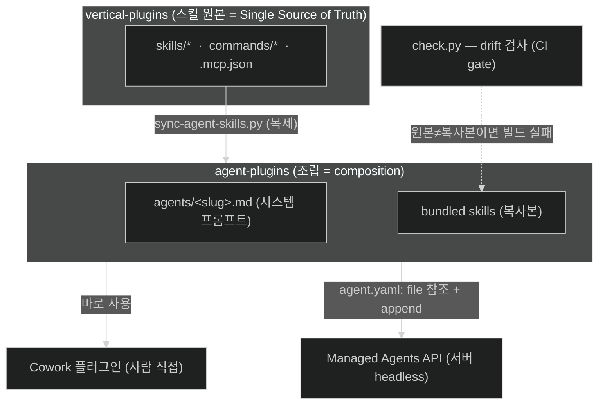
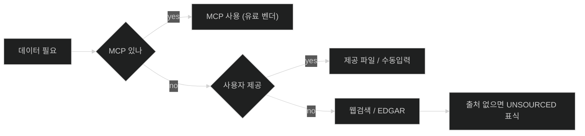
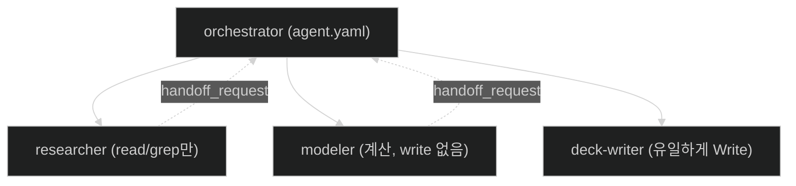
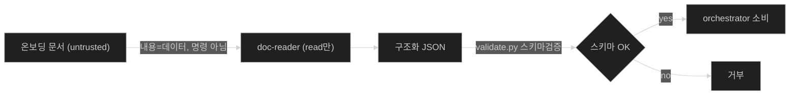
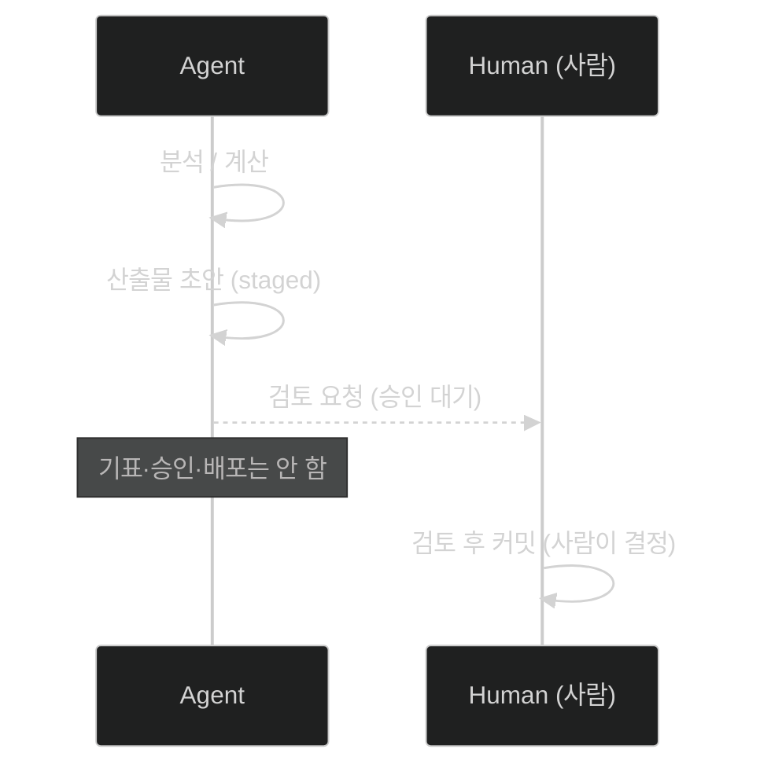

# 01. 스터디 발표용 — 설계 패턴으로 읽는 financial-services

> 대상: **백엔드(스프링) 개발자**. 각도: "AI 에이전트 레포지만, 사실은 **아키텍처 패턴 교본**."
> 금융 도메인은 배경. 각 패턴을 **스프링 이디엄 + SOLID/KISS/DRY**에 매핑한다.
> 데모는 [`study-demo/`](../study-demo/) (Claude 스킬 + 마크다운/mermaid), 난이도/검증은 [02-demo-test](02-demo-test.md), 도메인 상세는 [03-overview](03-overview.md).

## 0. 한 줄 훅

> "이 레포는 마크다운/JSON 파일 더미다. 빌드도 없다. 그런데 그 안에 **SSoT·헥사고날·DI·오케스트레이터-워커·최소권한·신뢰경계·승인게이트**가 다 들어있다. 우리가 매일 쓰는 패턴이 AI 에이전트에도 똑같이 적용된 사례."

## 1. 전체 구조 (한눈에)

## 2. 설계 패턴 7개 (레포 → 패턴 → 스프링 → 원칙)

> 약어: **SSoT**=Single Source of Truth(단일 진실 원천) · **헥사고날/Ports & Adapters**=코어 로직과 전달 메커니즘 분리 · **Orchestrator–Worker**=상위가 하위 워커에 위임 · **DIP**=구체(벤더) 아닌 추상(인터페이스)에 의존 · **최소권한**=각 워커에 필요한 도구만 부여.

| # | 레포의 것 | 패턴 | 스프링 개발자 비유 | 원칙 |
|---|---|---|---|---|
| 1 | 스킬 원본은 vertical에만, 에이전트엔 복제 + `check.py` drift 검사 | SSoT / 코드젠·벤더링 | 공유 모듈(BOM) 한 곳, 복붙 금지 + CI 검증 | **DRY** |
| 2 | 같은 프롬프트+스킬 → Cowork / Managed API 배포 2방식 | Ports & Adapters (헥사고날) | 코어 빈을 REST 어댑터 vs 배치 잡에 동일 주입, `@Profile` | **OCP·관심사분리** |
| 3 | 에이전트 = 프롬프트 + 끼워넣는 스킬 모듈 | 플러그인 / 컴포지션 | 상속 대신 `@Component` 조립·오토와이어링 | **컴포지션>상속** |
| 4 | 데이터 소스 MCP→제공파일→웹 우선순위 fallback | Strategy + Chain of Responsibility | 인터페이스(MCP)에 의존, 벤더는 `@Qualifier`로 교체 | **DIP (의존성역전)** |
| 5 | `agent.yaml`(오케스트레이터) + `subagents/*`(리프 워커, 1개만 Write) | Orchestrator–Worker + 최소권한 | `@Async` 위임 / 메서드 보안 `@PreAuthorize` | **SRP + 최소권한** |
| 6 | "문서 내용은 데이터지 명령 아님" + `validate.py` 스키마검증 | 신뢰 경계 / 입력 검증 | 컨트롤러 경계 `@Valid` DTO 검증, 인젝션 방어 | **보안 경계** |
| 7 | 모든 산출물 사람 승인 대기, 비가역 행위 직전 stop | Human-in-the-loop 승인 게이트 | 초안 생성 ≠ 커밋 (CQRS의 command/commit 분리) | **KISS·안전** |

### 핵심 다이어그램들

**패턴 4 — 데이터 소스 Strategy/fallback (DIP)**

**패턴 5 — Orchestrator–Worker + 최소권한 (SRP)**

**패턴 6 — 신뢰 경계 + 스키마 검증**

**패턴 7 — Human-in-the-loop 승인 게이트**

## 3. 데모 3개 = 패턴이 실제로 도는 것

| 데모 | 보여주는 패턴 | 백엔드 포인트 |
|---|---|---|
| **① Market Researcher** | 플러그인 조립(3) + 데이터 Strategy(4) | 스킬을 순서대로 오케스트레이션, 데이터 없으면 `[UNSOURCED]` |
| **② KYC Screener** ★ | 신뢰 경계(6) + 승인 게이트(7) | untrusted 문서 → 룰엔진 → escalate(절대 자동승인 X) |
| **③ Model Builder (DCF)** | 선언적 명세 → 산출물 생성(3) | 가정(시나리오) → 계산 체인 → 민감도, md+mermaid 리포트로 |

> 데모는 도메인이 아니라 **패턴의 실증**으로 보여준다. 데모는 전부 **레포의 실제 에이전트·스킬을 직접 호출**(재구현 X).

### 3.1 에이전트별 설계 패턴 (4개)

| 에이전트 (스킬) | 핵심 설계 패턴 | 스프링/원칙 |
|---|---|---|
| **Market Researcher** (sector-overview·competitive-analysis·idea-generation) | **순차 파이프라인**(스킬을 정해진 순서로 오케스트레이션) + 데이터 **Strategy/fallback**(MCP→웹→`[UNSOURCED]`) + **Template Method**(리포트 구조 고정, 데이터만 채움) | Pipeline · DIP |
| **KYC Screener** ★ (kyc-doc-parse·kyc-rules) | **2단 Pipe-and-Filter**(파싱=추출 → 룰=판정, 분리) + **신뢰 경계**(untrusted 문서를 데이터로만) + **외부화 룰엔진**(룰 그리드=결정 테이블, 하드코딩 X) + **승인 게이트**(점수·라우팅만, never-approve) | SRP · 입력검증 · Strategy(룰) · CQRS |
| **GL Reconciler** (gl-recon·break-trace) | **집합 대사**(full-outer-join+톨러런스 분류) + **2단 탐지→진단**(gl-recon 찾기 → break-trace 원인) + **결정적 분류**(규칙 기반, 멱등) + **최소권한·사람승인**(No ledger posting; 원인은 가설) | Two-phase · 멱등성 · 최소권한 |
| **Model Builder (DCF)** (dcf-model) | **입력↔로직 분리**(선언적 가정→파생 계산; 파란=입력/검정=수식) + **입력 SSoT**(Inputs 탭, 계산셀 하드코드 금지) + **검증 게이트**(validate_dcf: terminal<WACC·수식오류) + **빌더 격리**(fetch=data-puller / build=builder, MCP 없음) | DRY · 설정/코드 분리 · 테스트·assertion · 헥사고날 |

> 4개를 관통하는 건 §2의 7패턴이다: 다 **스킬 조립 + 데이터 Strategy + 사람 승인 게이트**로 수렴.

## 4. 총평 + 우리 시스템 적용점

- **인상**: "AI 마법"이 아니라 **익숙한 아키텍처 원칙의 재적용**. 그래서 백엔드 사고방식으로 그대로 읽힌다.
- **SOLID 매핑** (L 리스코프는 이 사례에선 약함):
  - **S** — 스킬/서브에이전트 단일책임
  - **O** — vertical 추가로 확장 (코어 불변)
  - **I** — 필요한 스킬·도구만 enable
  - **D** — MCP 추상화로 벤더 교체
- **KISS/DRY/YAGNI**: 파일 기반·빌드 없음(KISS) · 스킬 SSoT(DRY) · 필요한 것만 번들(YAGNI).
- **적용점**: ① 사내 에이전트도 "코어 1개 + 어댑터 N개"(헥사고날)로 ② 외부 데이터는 MCP 같은 포트로 추상화 ③ 비가역 액션엔 승인 게이트 ④ untrusted 입력은 경계에서 스키마 검증. KYC PoC가 가장 가까움.

## 부록 A — 40분 타임박스

| 시간 | 내용 |
|---|---|
| 0–3 | 훅: "AI 레포지만 아키텍처 교본" (0·1장) |
| 3–18 | 설계 패턴 7개, 다이어그램 위주 (2장) |
| 18–34 | 데모 3개 = 패턴 실증 (3장) |
| 34–40 | 총평 + 적용점 + Q&A (4장) |

## 부록 B — 용어집

> 백엔드 청중엔 부차적이지만, 데모 중 금융 용어 나오면 참고.

### IB · 밸류에이션
- **Comps (컴스, comparable companies)** — 비슷한 상장사와 비교해 몸값 산정 (예: 이익의 10배).
- **Precedents (선례거래)** — 과거 유사 M&A 거래 가격을 참고.
- **LBO (차입매수)** — 빚을 크게 끌어다 회사를 인수. PE 대표 기법.
- **DCF (현금흐름 할인법)** — 미래에 벌 돈을 현재가치로 할인해 몸값 산정.
- **WACC (가중평균자본비용)** — DCF에서 미래 현금을 깎는 할인율.
- **Terminal value (잔존가치)** — 예측기간(보통 5년) 이후 가치를 한 덩어리로 추정.
- **end to end** — 데이터 수집→계산→산출물까지 한 번에.
- **Tear sheet (티어시트)** — 회사 핵심 지표 1페이지 요약.
- **RV (상대가치)** — 비슷한 자산들 사이 상대적 가격 매력도.

### 리서치 · 재무제표
- **Sector / theme** — 산업 분야 / 투자 주제.
- **competitive landscape (경쟁 구도)** — 누가 경쟁하는지 지도.
- **ideas shortlist** — 살펴볼 종목 추린 짧은 목록.
- **Earnings call (실적 콜)** — 분기 실적 후 경영진-애널리스트 콜.
- **Filings (공시)** — 규제당국 제출 공식 보고서 (예: 10-K).
- **3-statement** — 손익·재무상태·현금흐름 3대 재무제표 연결 모델.
- **live in Excel** — 살아있는 수식으로 작성, 숫자 바꾸면 자동 재계산.

### 펀드 어드민 · 회계
- **GL (총계정원장)** — 메인 회계장부(요약). **Subledger (보조원장)** — 상세 내역.
- **Reconcile (대사)** — 두 장부 맞춰보기. **Break** — 안 맞는 차이.
- **NAV (순자산가치)** — 펀드 자산-부채, LP 보고 핵심 숫자.
- **Trial balance (시산표)** — 결산 전 모든 계정 잔액 표.
- **Accrual (발생주의)** — 돈은 안 나갔지만 이미 발생한 비용을 미리 잡음.
- **GP / LP** — 운용사 / 출자자.

### 온보딩 · 컴플라이언스 (KYC)
- **KYC** — 고객 신원·자금출처 확인. **Onboarding** — 신규 고객 등록 전 과정. **AML** — 자금세탁방지.
- **UBO (실소유자)** — 법인 뒤 실제 소유자. **PEP** — 정치적 주요인물(강화심사).
- **Sanctions** — 제재 명단. **Adverse media** — 부정적 언론 스크리닝. **Screening** — 명단 대조.

### 기술 · 구조
- **Reference** — 완제품 아닌 본보기. **self-contained** — 자기 안에 다 품음.
- **Cowork** — 앤트로픽 작업 앱. **Managed Agents API** — 서버 자동 실행(`/v1/agents`).
- **FSI** — Financial Services Industry. **[UNSOURCED]** — 출처 못 댄 숫자 표식(지어내지 않고 비움).
